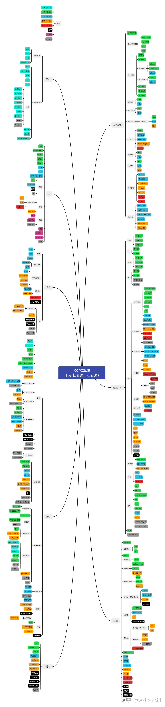

# Algorithm Template

[TOC]




## 1 编译命令 Compile Command

Sublime Text Build File for C++14 in Windows

```JSON
{
"encoding": "utf-8",
"working_dir": "$file_path",
"shell_cmd": "g++ -Wall -Wextra -std=c++14  -Wl,--stack=80000000 \"$file_name\" -o \"$file_base_name\"",
"file_regex": "^(..[^:]*):([0-9]+):?([0-9]+)?:? (.*)$",
"selector": "source.c++", "variants": 
[
    {   
    "name": "Compile",
		"shell_cmd": "g++ -Wall -Wextra -std=c++14 -Wl,--stack=80000000 \"$file_name\" -o \"$file_base_name\" -DLOCAL_LIGEN",
    },
    {   
    "name": "Run",
        "shell_cmd": "start cmd /c \"\"${file_path}/${file_base_name}\" & pause\""
    },
    {   
    "name": "Compile_and_Run",
        "shell_cmd": "g++ -Wall -Wextra -std=c++14 -Wl,--stack=80000000 \"$file_name\" -o \"$file_base_name\" -DLOCAL_LIGEN && start cmd /c \"\"${file_path}/${file_base_name}\" & pause\""
    },
]
}
```

## 2 头文件 Head Files

```cpp
// copyright (c) 2022 ligen131 <1353055672@qq.com>
// #pragma GCC optimize(3)
#include <iostream>
#include <fstream>
#include <cstdio>
#include <algorithm>
#include <cmath>
#include <cstring>
#include <string>
#include <set>
#include <map>
#include <queue>
#include <stack>
#include <bitset>
#include <vector>
#include <assert.h>
#include <ctime>
using namespace std;

#define ll long long
#define ull unsigned long long
#define infll (long long)(1e18)
#define infint (int)(1 << 30)
#define mod (int)(1e9 + 7)
#define FOR(a, b, c) for(int a = b; a <= c; ++a)
#define FORD(a, b, c) for(int a = b; a >= c; --a)
#define YES(v) ((v) ? puts("Yes") : puts("No"))

template <typename T>
inline T Max(const T &a, const T &b) {return a > b ? a : b;}
template <typename T>
inline T Min(const T &a, const T &b) {return a < b ? a : b;}
template <typename T>
inline T Abs(const T &a) {return a > 0 ? a : - a;}
template <typename T>
inline void Swap(T &a, T &b) {T c = a; a = b; b = c;}
template <typename T>
inline T MOD(T &a) {return a %= mod;}
template <typename T>
inline T MOD(const T &a) {return a % mod;}

// #define READ_BUF_LEN 1<<20
// char READ_BUF[READ_BUF_LEN], *READ_P1 = READ_BUF, *READ_P2 = READ_BUF;
// #define getchar() (READ_P1 == READ_P2 && (READ_P2 = (READ_P1 = READ_BUF) + fread(READ_BUF, 1, READ_BUF_LEN, stdin), READ_P1 == READ_P2) ? EOF : *READ_P1++)
template <typename T>
inline T read(T &a) {
	char c; bool neg = false; a = 0;
	for(c = getchar(); c < '0' || c > '9'; neg |= c == '-', c = getchar());
	for(; c >= '0' && c <= '9'; a = a * 10 - '0' + c, c = getchar());
	if (neg) a = -a;
	return a;
}
template <typename T, typename... Args>
inline void read(T &a, Args&... args) {read(a); read(args...);}
inline long long read() {long long a; return read(a);}
char WRITE_BUF[40];
template <typename T>
inline void write(T a) {
	if (!a) return putchar('0'), void();
	if (a < 0) putchar('-'), a = -a;
	int len = 0;
	while (a) WRITE_BUF[++len] = a % 10 + '0', a /= 10;
	for(int i = len; i; --i) putchar(WRITE_BUF[i]);
}
inline void write_() {return;}
template <typename T, typename... Args>
inline void write_(T a, Args... args) {write(a); putchar(' '); write_(args...);}
inline void writeln() {putchar('\n'); return;}
template <typename T, typename... Args>
inline void writeln(T a, Args... args) {write(a); if (sizeof...(args)) putchar(' '); writeln(args...);}

template <typename T>
T gcd(const T &a, const T &b) {return a == 0 ? b : gcd(b % a, a);}
inline long long lcm(const long long &a, const long long &b) {return 1ll * a / gcd(a, b) * b;}
inline long long Pow(long long a, long long n) {
	long long ans = 1;
	while(n) {
		if (n & 1) ans = 1ll * ans * a % mod;
		a = 1ll * a * a % mod;
		n >>= 1;
	}
	return ans;
}
//-------------------------------Head Files-------------------------------//
#define mn 200020

signed main() {
#ifdef LOCAL_LIGEN
	freopen("D:\\Code\\0.in","r",stdin);
	//freopen("0.out","w",stdout);
	const double PROGRAM_BEGIN_TIME = clock();
#endif
	int a,b;
	read(a, b);
	Swap(a, b);
	writeln(a, b, a + b, Max(a, b), Min(a, b), Abs(a));
#ifdef LOCAL_LIGEN
	printf("Time: %.0lfms\n", clock() - PROGRAM_BEGIN_TIME);
	fclose(stdin); fclose(stdout);
#endif
}
```

## 3 基础 Basic

### 3.1 排序

#### 3.1.1 选择排序

#### 3.1.2 冒泡排序

#### 3.1.3 插入排序

#### 3.1.4 归并排序

#### 3.1.5 桶排序

#### 3.1.6 基数排序

### 3.2 高精度

### 3.3 搜索

#### 3.3.1 折半搜索 Meet in the Middle

## 4 数据结构 Data Structure

### 4.1 单调队列

有一个长为 $n$ 的序列 $A$ ，以及一个大小为 $k$ 的窗口。现在这个从左边开始向右滑动，每次滑动一个单位，求出每次滑动后窗口中的最大值和最小值。

```cpp
int ama[mn],ami[mn],qma[mn],qmi[mn],ma[mn],mi[mn];
int main(){
	int n,k;
	scanf("%d%d",&n,&k);
	int x,fma,tma,fmi,tmi;
	fma=fmi=1;tma=tmi=0;
	FOR(i,1,n){
		x=read();
		if(fma<=tma&&qma[fma]<=i-k)fma++;
		if(fmi<=tmi&&qmi[fmi]<=i-k)fmi++;
		while(fma<=tma&&ma[tma]<=x)tma--;
		while(fmi<=tmi&&mi[tmi]>=x)tmi--;
		tma++;tmi++;
		ma[tma]=mi[tmi]=x;qma[tma]=qmi[tmi]=i;
		ama[i]=ma[fma];
		ami[i]=mi[fmi];
	}
	FOR(i,k,n-1)printf("%d ",ami[i]);printf("%d\n",ami[n]);
	FOR(i,k,n-1)printf("%d ",ama[i]);printf("%d\n",ama[n]);
	
	return 0;
}
```

### 4.2 单调栈

### 4.3 树

#### 4.3.1 树的重心

#### 4.3.2 树的直径

#### 4.3.3 最近公共祖先 LCA

DFS 序 + ST 表

```cpp
int in[mn],b[mn],f[mn][30],fir[mn],nxt[mn],y[mn],tot,de[mn],ti,num[mn],tot2,n2[mn];
inline void add(int x,int y1){
	nxt[++tot]=fir[x];fir[x]=tot;y[tot]=y1;
}
void dfs(int d,int x){
	in[x]=++ti;
	if(!num[x])num[x]=++tot2,n2[tot2]=x;
	b[ti]=num[x];
	for(int i=fir[x];i!=-1;i=nxt[i])
		if(!in[y[i]]){
			dfs(d+1,y[i]);
			b[++ti]=num[x];
		}
	return;
}
int main(){
	int n=read(),m=read(),s=read(),x,y;
	ti=tot=tot2=0;
	FOR(i,1,m)fir[i]=-1;
	FOR(i,1,n-1)x=read(),y=read(),add(x,y),add(y,x);
	dfs(1,s);
	FOR(i,1,ti)f[i][0]=b[i];
	for(int j=1;(1<<j)<=ti;j++)
		for(int i=1;i+(1<<j)-1<=ti;i++){
			f[i][j]=min(f[i][j-1],f[i+(1<<(j-1))][j-1]);
		}
	int k=0;
	FOR(i,1,m){
		x=in[read()];y=in[read()];
		if(x>y)swap(x,y);
		k=trunc(log2(y-x+1));
		printf("%d\n",n2[Min(f[x][k],f[y-(1<<k)+1][k])]);
	}
	return 0;
}
```

倍增

```cpp
#include <iostream>
#include <cstdio>
#include <cstring>
#include <algorithm>
using namespace std;
struct zzz {
    int t, nex;
}e[500010 << 1]; int head[500010], tot;
void add(int x, int y) {
	e[++tot].t = y;
	e[tot].nex = head[x];
	head[x] = tot;
}
int depth[500001], fa[500001][22], lg[500001];
void dfs(int now, int fath) {
	fa[now][0] = fath; depth[now] = depth[fath] + 1;
	for(int i = 1; i <= lg[depth[now]]; ++i)
		fa[now][i] = fa[fa[now][i-1]][i-1];
	for(int i = head[now]; i; i = e[i].nex)
		if(e[i].t != fath) dfs(e[i].t, now);
}
int LCA(int x, int y) {
	if(depth[x] < depth[y]) swap(x, y);
	while(depth[x] > depth[y])
		x = fa[x][lg[depth[x]-depth[y]] - 1];
	if(x == y) return x;
	for(int k = lg[depth[x]] - 1; k >= 0; --k)
		if(fa[x][k] != fa[y][k])
			x = fa[x][k], y = fa[y][k];
	return fa[x][0];
}
int main() {
	int n, m, s; scanf("%d%d%d", &n, &m, &s);
	for(int i = 1; i <= n-1; ++i) {
		int x, y; scanf("%d%d", &x, &y);
		add(x, y); add(y, x);
	}
	for(int i = 1; i <= n; ++i)
		lg[i] = lg[i-1] + (1 << lg[i-1] == i);
	dfs(s, 0);
	for(int i = 1; i <= m; ++i) {
		int x, y; scanf("%d%d",&x, &y);
		printf("%d\n", LCA(x, y));
	}
	return 0;
}
```

### 4.4 线段树

#### 4.4.1 线段树

操作 1： 格式：`1 x y k` 含义：将区间 $[x,y]$ 内每个数乘上 $k$ 

操作 2： 格式：`2 x y k` 含义：将区间 $[x,y]$ 内每个数加上 $k$ 

操作 3： 格式：`3 x y` 含义：输出区间 $[x,y]$ 内每个数的和对 $p$ 取模所得的结果

```cpp
ll sum[mn],f[mn][3],n,m,p,a[mn];
inline void Up(ll h){
    sum[h]=(sum[h<<1]+sum[(h<<1)|1])%p;
}
inline void Down(ll h,ll l,ll r){
    sum[h<<1]=(sum[h<<1]*f[h][1]*1ll%p+f[h][0]*l%p)%p;
    sum[(h<<1)|1]=(sum[(h<<1)|1]*f[h][1]*1ll%p+f[h][0]*r%p)%p;
	f[h<<1][0]=(f[h<<1][0]*f[h][1]%p+f[h][0])%p;
	f[(h<<1)|1][0]=(f[(h<<1)|1][0]*f[h][1]%p+f[h][0])%p;
	f[h][0]=0;
	f[h<<1][1]=f[h][1]*f[h<<1][1]*1ll%p;
	f[(h<<1)|1][1]=f[h][1]*f[(h<<1)|1][1]*1ll%p;
	f[h][1]=1;
}
inline void build(ll l,ll r,ll h){
	f[h][1]=1;f[h][0]=0;
    if(l==r){sum[h]=a[l]%p;return;}
    ll m=(l+r)>>1;build(l,m,h<<1);build(m+1,r,(h<<1)|1);
    Up(h);
}
inline void addx(ll x,ll y,ll c,ll l,ll r,ll h){
    if(x<=l&&r<=y){f[h][1]=f[h][1]*c*1ll%p;sum[h]=sum[h]*c*1ll%p;f[h][0]=1ll*f[h][0]*c%p;return;}
    ll m=(l+r)>>1;Down(h,m-l+1,r-m);
    if(x<=m)addx(x,y,c,l,m,h<<1);
    if(y>m)addx(x,y,c,m+1,r,(h<<1)|1);
    Up(h);
}
inline void add(ll x,ll y,ll c,ll l,ll r,ll h){
    if(x<=l&&r<=y){f[h][0]=(f[h][0]+c)%p;sum[h]=(sum[h]+c*(r-l+1))%p;return;}
    ll m=(l+r)>>1;Down(h,m-l+1,r-m);
    if(x<=m)add(x,y,c,l,m,h<<1);
    if(y>m)add(x,y,c,m+1,r,(h<<1)|1);
    Up(h);
}
inline ll ask(ll x,ll y,ll l,ll r,ll h){
    if(x<=l&&r<=y)return sum[h]%p;
    ll m=(l+r)>>1,ans=0;Down(h,m-l+1,r-m);
    if(x<=m)ans=(ans+ask(x,y,l,m,h<<1))%p;
    if(y>m)ans=(ans+ask(x,y,m+1,r,(h<<1)|1))%p;
    return ans%p;
}
int main(){
    n=read(),m=read(),p=read();
    ll b,x,y,z;
    FOR(i,1,n)a[i]=read();
    build(1,n,1);
    FOR(i,1,m){
        b=read(),x=read(),y=read();
        if(b==1){
            z=read();addx(x,y,z,1,n,1);
        }else if(b==2){
            z=read();add(x,y,z,1,n,1);
        }else writeln(ask(x,y,1,n,1)%p);
    }
    return 0;
}
```

#### 4.4.2 扫描线

求 $n$ 个矩形的面积并。

```cpp
int q,n,m,b[mn],tot;
struct node{
	int x,Y,YY,c;
}a[mn];
ll ans;
inline bool cmp(const node &a,const node &b){return a.x<b.x;}
struct sgt{
	#define L (h<<1)
	#define R (h<<1|1)
	int sum[mn<<2],s2[mn<<2],f[mn<<2];
	inline void Up(int h,int l,int r){
		if(sum[h]>0)s2[h]=b[r+1]-b[l];else 
		s2[h]=s2[L]+s2[R];
	}
	inline void add(int x,int y,int c,int l,int r,int h){
		if(x<=l&&r<=y){
			sum[h]+=c;
			Up(h,l,r);
			return;
		}
		int mid=(l+r)>>1;
		if(x<=mid)add(x,y,c,l,mid,L);
		if(y>mid)add(x,y,c,mid+1,r,R);
		Up(h,l,r);
	}
}t;
inline void add(int x,int y,int c){
	x=lower_bound(b+1,b+1+tot,x)-b,y=lower_bound(b+1,b+1+tot,y)-b;
	t.add(x,y-1,c,1,tot,1);
}
signed main() {
	q=read();
	FOR(i,1,q){
		a[i].x=read(),a[i].Y=read(),a[i+q].x=read(),a[i].YY=read();
		a[i].c=1;
		a[i+q].Y=a[i].Y,a[i+q].YY=a[i].YY;
		a[i+q].c=-1;
		b[i]=a[i].Y,b[i+q]=a[i].YY;
	}
	sort(b+1,b+1+q+q);
	sort(a+1,a+1+q+q,cmp);
	tot=unique(b+1,b+1+q+q)-b-1;
	int now=1,ls=0;
	while(now<=q+q){
		if(now>1)ans+=1ll*(a[now].x-ls)*t.s2[1];
		ls=a[now].x;
		add(a[now].Y,a[now].YY,a[now].c),++now;
		while(now<=q+q&&a[now].x==a[now-1].x)add(a[now].Y,a[now].YY,a[now].c),++now;
	}
	ans+=t.s2[1];
	writeln(ans);
	return 0;
}
```

#### 4.4.3 可持久化线段树 / 主席树

给定 $n$ 个整数构成的序列 $A$ ，将对于指定的闭区间 $[l,r]$ 查询其区间内的第 $k$ 小值。

```cpp
int n,q,a[mn],b[mn],m,x,y,z,root[mn];
struct psgt{
	#define m ((l+r)>>1)
	int tot,sum[mn],ls[mn],rs[mn];
	inline void clear(){tot=0;memset(sum,0,sizeof(sum));memset(ls,0,sizeof(ls));memset(rs,0,sizeof(rs));}
	inline int build(int l,int r){
		int h=++tot;
		if(l==r)return sum[h]=0,h;
		ls[h]=build(l,m);rs[h]=build(m+1,r);
		return h;
	}
	inline int add(int v,int x,int c,int l,int r){
		int h=++tot;
		if(l==r)return sum[h]=sum[v]+c,h;
		ls[h]=ls[v];rs[h]=rs[v];sum[h]=sum[v]+c;
		if(x<=m)ls[h]=add(ls[v],x,c,l,m);else rs[h]=add(rs[v],x,c,m+1,r);
		return h;
	}
	inline int ask(int u,int v,int k,int l,int r){
		if(l==r)return b[l];
		if(k<=sum[ls[v]]-sum[ls[u]])return ask(ls[u],ls[v],k,l,m);
		return ask(rs[u],rs[v],k-sum[ls[v]]+sum[ls[u]],m+1,r);
	}
	#undef m
}t;
int main(){
    n=read(),q=read();
    FOR(i,1,n)a[i]=read(),b[i]=a[i];
    sort(b+1,b+1+n);m=unique(b+1,b+1+n)-b-1;
    t.clear();root[0]=t.build(1,m);
    FOR(i,1,n){
    	x=lower_bound(b+1,b+1+m,a[i])-b;
    	root[i]=t.add(root[i-1],x,1,1,m);
    }
    FOR(i,1,q){
    	x=read(),y=read(),z=read();
    	writeln(t.ask(root[x-1],root[y],z,1,m));
    }
    return 0;
}
```

你需要维护这样的一个长度为 $N$ 的数组，支持如下几种操作

1. 在某个历史版本上修改某一个位置上的值
2. 访问某个历史版本上的某一位置的值

此外，每进行一次操作（**对于操作 2 ，即为生成一个完全一样的版本，不作任何改动**），就会生成一个新的版本。版本编号即为当前操作的编号（从 1 开始编号，版本 0 表示初始状态数组）

```cpp
int n,q,a[mn],v,x,y,z,root[mn];
struct psgt{
	#define m ((l+r)>>1)
	int sum[mn],tot,ls[mn],rs[mn];
	inline void clear(){memset(sum,0,sizeof(sum));memset(ls,0,sizeof(ls));memset(rs,0,sizeof(rs));tot=0;}
	inline int build(int l,int r){
		int h=++tot;
		if(l==r)return sum[h]=a[l],h;
		ls[h]=build(l,m);rs[h]=build(m+1,r);
		return h;
	}
	inline int add(int v,int x,int c,int l,int r){
		int h=++tot;
		if(l==r)return sum[h]=c,h;
		ls[h]=ls[v];rs[h]=rs[v];
		if(x<=m)ls[h]=add(ls[v],x,c,l,m);
		else rs[h]=add(rs[v],x,c,m+1,r);
		return h;
	}
	inline int ask(int v,int x,int l,int r){
		if(l==r)return sum[v];
		if(x<=m)return ask(ls[v],x,l,m);
		return ask(rs[v],x,m+1,r);
	}
	#undef m
}t;
int main(){
    n=read(),q=read();
    t.clear();
    FOR(i,1,n)a[i]=read();
    t.build(1,n);root[0]=1;
    FOR(i,1,q){
    	v=read(),x=read(),y=read();
    	if(x==1){
    		z=read();
    		root[i]=t.tot+1;
    		t.add(root[v],y,z,1,n);
    	}else{
    		root[i]=root[v];
    		writeln(t.ask(root[v],y,1,n));
    	}
    }
    return 0;
}
```

#### 4.4.4 线段树合并

村落里的一共有 $n$ 座房屋，并形成一个树状结构。然后救济粮分 $m$ 次发放，每次选择两个房屋 $(x,y)$ ，然后对于 $x$ 到 $y$ 的路径上(含 $x$ 和 $y$ )每座房子里发放一袋 $z$ 类型的救济粮。问当所有的救济粮发放完毕后，每座房子里存放的最多的是哪种救济粮。

```cpp
int n,m,fir[mn],nxt[mn],y[mn],tot,x,yy,c[mn],z,fa[mn],f[mn][35],now,h[mn],cnt,l[mn],Lg[mn],rt[mn],an[mn];
inline void adde(int x,int yy){
	nxt[++tot]=fir[x];fir[x]=tot;y[tot]=yy;
}
vector<int>v1[mn],v2[mn];
struct sgt{
	#define MN 10000020
	int ls[MN],rs[MN],tot,mx[MN],mxi[MN];
	inline void Up(int h){
		if(mx[ls[h]]>=mx[rs[h]])mx[h]=mx[ls[h]],mxi[h]=mxi[ls[h]];
		else mx[h]=mx[rs[h]],mxi[h]=mxi[rs[h]];
	}
	inline void add(int x,int c,int l,int r,int &h){
		if(!h)h=++tot;
		if(l==r){mx[h]+=c;mxi[h]=l;return;}
		int mid=(l+r)>>1;
		if(x<=mid)add(x,c,l,mid,ls[h]);else add(x,c,mid+1,r,rs[h]);
		Up(h);
	}
	inline int merge(int u,int v,int l,int r){
		if(!u||!v)return u|v;
		if(l==r){mx[u]+=mx[v];mxi[u]=l;return u;}
		int mid=(l+r)>>1;
		ls[u]=merge(ls[u],ls[v],l,mid);
		rs[u]=merge(rs[u],rs[v],mid+1,r);
		Up(u);
		return u;
	}
}t;
inline void dfs(int x){
	f[++now][0]=++cnt,h[cnt]=x;l[x]=now;
	int dfn=cnt;
	for(int i=fir[x];i;i=nxt[i])if(y[i]!=fa[x]){
		fa[y[i]]=x;
		dfs(y[i]);
		f[++now][0]=dfn;
	}
}
inline void rmq(){
	Lg[1]=0;
	FOR(i,2,now)Lg[i]=Lg[i>>1]+1;
	for(int j=1;(1<<j)<=now;++j)
		for(int i=1;i+(1<<j)-1<=now;++i)
			f[i][j]=Min(f[i][j-1],f[i+(1<<(j-1))][j-1]);
}
inline int lca(int x,int y){
	x=l[x],y=l[y];
	if(x>y)swap(x,y);
	int k=Lg[y-x+1];
	return h[Min(f[x][k],f[y-(1<<k)+1][k])];
}
inline void dfs2(int x){
	for(int i=fir[x];i;i=nxt[i])if(y[i]!=fa[x]){
		dfs2(y[i]);
		rt[x]=t.merge(rt[x],rt[y[i]],1,1000000);
	}
	if(t.mx[rt[x]])an[x]=t.mxi[rt[x]];
}
signed main() {
	n=read(),m=read();
	FOR(i,2,n)x=read(),yy=read(),adde(x,yy),adde(yy,x);
	dfs(1);
	rmq();
	int lc;
	FOR(i,1,m){
		x=read(),yy=read(),z=read();
		lc=lca(x,yy);
		t.add(z,1,1,1000000,rt[x]);
		t.add(z,1,1,1000000,rt[yy]);
		t.add(z,-1,1,1000000,rt[lc]);
		if(fa[lc])t.add(z,-1,1,1000000,rt[fa[lc]]);
	}
	dfs2(1);
	FOR(i,1,n)writeln(an[i]);
	return 0;
}
```

### 4.5 树状数组

#### 4.5.1 树状数组

- `1 x k` 含义：将第 $x$ 个数加上 $k$ 
- `2 x y` 含义：输出区间 $[x,y]$ 内每个数的和

```cpp
#include <iostream>
#include <cstdio>
#include <algorithm>
#include <cmath>
#include <cstring>
using namespace std;
int n,m,tree[2000010];
int lowbit(int k){
	return k & -k;
}
void add(int x,int k){
	while(x<=n)
	{
		tree[x]+=k;
		x+=lowbit(x);
	}
}
int sum(int x){
	int ans=0;
	while(x!=0)
	{
		ans+=tree[x];
		x-=lowbit(x);
	}
	return ans;
}
int main(){
	cin>>n>>m;
	for(int i=1;i<=n;i++){
		int a;
		scanf("%d",&a);
		add(i,a);
	}
	for(int i=1;i<=m;i++){
		int a,b,c;
		scanf("%d%d%d",&a,&b,&c);
		if(a==1)
			add(b,c);
		if(a==2)
			cout<<sum(c)-sum(b-1)<<endl;
	}
}
```

#### 4.5.2 树状数组求第 k 大

#### 4.5.3 多维树状数组

### 4.6 平衡树

1. 插入 $x$ 数
2. 删除 $x$ 数(若有多个相同的数，因只删除一个)
3. 查询 $x$ 数的排名(排名定义为比当前数小的数的个数 +1 )
4. 查询排名为 $x$ 的数
5. 求 $x$ 的前驱(前驱定义为小于 $x$ ，且最大的数)
6. 求 $x$ 的后继(后继定义为大于 $x$ ，且最小的数)

#### 4.6.1 Splay

#### 4.6.2 Treap

```cpp
int n,root,x,y;
struct Treap{
	int tot,ls[mn],rs[mn],siz[mn],key[mn],sa[mn],num[mn];
	inline int Rand(){
		static int seed=2019;
		return seed=(int)seed*482711LL%2147483647;
	}
	inline void Up(int h){
		siz[h]=siz[ls[h]]+siz[rs[h]]+sa[h];
	}
	inline void zag(int &h){
		int r=rs[h];
		rs[h]=ls[r];ls[r]=h;
		siz[r]=siz[h];Up(h);
		h=r;
	}
	inline void zig(int &h){
		int l=ls[h];
		ls[h]=rs[l];rs[l]=h;
		siz[l]=siz[h];Up(h);
		h=l;
	}
	inline void add(int &h,int c){
		if(!h){
			h=++tot;
			siz[h]=sa[h]=1;num[h]=c;key[h]=Rand();
			return;
		}
		++siz[h];
		if(num[h]==c){++sa[h];return;}
		if(num[h]>c){
			add(ls[h],c);
			if(key[ls[h]]>key[h])zig(h);
		}else{
			add(rs[h],c);
			if(key[rs[h]]>key[h])zag(h);
		}
	}
	inline void del(int &h,int c){
		if(!h)return;
		--siz[h];
		if(num[h]==c){
			if(sa[h]>1){--sa[h];return;}
			if(!ls[h]||!rs[h]){h=ls[h]+rs[h];return;}
			if(key[ls[h]]<key[rs[h]])zig(h),del(rs[h],c);
			else zag(h),del(ls[h],c);
			return;
		}
		if(num[h]<c)del(rs[h],c);else del(ls[h],c);
	}
	inline int ask_rank(int h,int c){
		if(!h)return 0;
		if(num[h]==c)return siz[ls[h]]+1;
		if(num[h]<c)return ask_rank(rs[h],c)+siz[ls[h]]+sa[h];
		return ask_rank(ls[h],c);
	}
	inline int ask_kth(int h,int k){
		if(!h)return 0;
		if(siz[ls[h]]>=k)return ask_kth(ls[h],k);
		k-=siz[ls[h]];
		if(k<=sa[h])return num[h];
		return ask_kth(rs[h],k-sa[h]);
	}
	inline int ask_front(int h,int c){
		if(!h)return -infint;
		if(num[h]>=c)return ask_front(ls[h],c);
		int a=ask_front(rs[h],c);
		return Max(a,num[h]);
	}
	inline int ask_back(int h,int c){
		if(!h)return infint;
		if(num[h]<=c)return ask_back(rs[h],c);
		int a=ask_back(ls[h],c);
		return Min(a,num[h]);
	}
}t;
signed main(){
    n=read();
    root=0;
    while(n--){
    	y=read(),x=read();
    	if(y==1)t.add(root,x);else
    	if(y==2)t.del(root,x);else
    	if(y==3)writeln(t.ask_rank(root,x));else
    	if(y==4)writeln(t.ask_kth(root,x));else
    	if(y==5)writeln(t.ask_front(root,x));else
    	writeln(t.ask_back(root,x));
    }
    return 0;
}
```

#### 4.6.3 Fhq Treap

```cpp
int n,x,y;
struct Fhq_Treap{
	int sz[mn],num[mn],key[mn],ls[mn],rs[mn],sa[mn],tot,root;
	inline int Rand(){
		static int seed=2019;
		return seed=(int)(492711ll*seed);
	}
	inline void Up(int h){
		sz[h]=sz[ls[h]]+sz[rs[h]]+sa[h];
	}
	inline int new_node(int c){
		++tot;sz[tot]=sa[tot]=1;num[tot]=c;key[tot]=Rand();
		ls[tot]=rs[tot]=0;
		return tot;
	}
	inline void split(int h,int c,int &x,int &y){
		if(!h){x=y=0;return;}
		if(num[h]<=c){
			x=h;split(rs[h],c,rs[h],y);
			Up(h);
			return;
		}
		y=h;split(ls[h],c,x,ls[h]);
		Up(h);
	}
	inline int merge(int x,int y){
		if(!x||!y)return x|y;
		if(key[x]<key[y]){
			rs[x]=merge(rs[x],y);Up(x);
			return x;
		}
		ls[y]=merge(x,ls[y]);Up(y);
		return y;
	}
	inline int find(int c,int h){
		if(!h)return -1;
		if(num[h]==c)return h;
		if(num[h]<c)return find(c,rs[h]);
		else find(c,ls[h]);
	}
	inline void insert(int c){
		int r1=0,r2=0;
		split(root,c,r1,r2);
		root=merge(merge(r1,new_node(c)),r2);
	}
	inline void erase(int c){
		int r1=0,r2=0,r3=0;
		split(root,c,r1,r3);split(r1,c-1,r1,r2);
		r2=merge(ls[r2],rs[r2]);root=merge(merge(r1,r2),r3);
	}
	inline int kth(int k,int h){
		while(h){
			if(k<=sz[ls[h]])h=ls[h];else
			if(k-sz[ls[h]]<=sa[h])return num[h];else
			k-=sz[ls[h]]+sa[h],h=rs[h];
		}
		return -1;
	}
	inline int rank(int c){
		int r1=0,r2=0,ans;
		split(root,c-1,r1,r2);ans=sz[r1]+1;
		root=merge(r1,r2);return ans;
	}
	inline int upper_bound(int c){
		int r1=0,r2=0,ans;split(root,c,r1,r2);
		ans=kth(1,r2);root=merge(r1,r2);return ans;
	}
	inline int backer_bound(int c){
		int r1=0,r2=0,ans;split(root,c-1,r1,r2);
		ans=kth(sz[r1],r1);root=merge(r1,r2);return ans;
	}
}t;
int main(){
	n=read();
	FOR(i,1,n){
		y=read(),x=read();
		if(y==1)t.insert(x);else
		if(y==2)t.erase(x);else
		if(y==3)writeln(t.rank(x));else
		if(y==4)writeln(t.kth(x,t.root));else 
		if(y==5)writeln(t.backer_bound(x));else
		writeln(t.upper_bound(x));
	}
	return 0;
}
```

翻转一个区间，例如原有序序列是 $5\ 4\ 3\ 2\ 1$ ，翻转区间是 $[2,4]$ 的话，结果是 $5\ 2\ 3\ 4\ 1$ 。

```cpp
int n,m,x,y;
struct Fhq_Treap{
	int siz[mn],num[mn],ls[mn],rs[mn],key[mn],tot,root,s[mn],t;
	bool f[mn];
	inline int Rand(){
		static int seed=2019;
		return seed=(int)seed*492711ll;
	}
	inline void Up(int h){
		siz[h]=siz[ls[h]]+siz[rs[h]]+1;
	}
	inline void Down(int h){
		if(f[h]){
			swap(ls[h],rs[h]);
			if(ls[h])f[ls[h]]^=1;
			if(rs[h])f[rs[h]]^=1;
			f[h]=0;
		}
	}
	inline void split(int h,int k,int &x,int &y){
		if(!h){x=y=0;return;}
		Down(h);
		if(k<=siz[ls[h]])y=h,split(ls[h],k,x,ls[h]);
		else x=h,split(rs[h],k-siz[ls[h]]-1,rs[h],y);
		Up(h);
	}
	inline int merge(int x,int y){
		if(!x||!y)return x+y;
		Down(x);Down(y);
		if(key[x]<key[y]){
			rs[x]=merge(rs[x],y),Up(x);
			return x;
		}
		ls[y]=merge(x,ls[y]),Up(y);
		return y;
	}
	inline int new_node(int c){
		++tot;siz[tot]=1;num[tot]=c;key[tot]=Rand();
		return tot;
	}
	inline void build(int n){
		int h,lt;
		FOR(i,1,n){
			h=new_node(i);lt=0;
			while(t&&key[s[t]]>key[h])Up(s[t]),lt=s[t--];
			if(!t)root=h;
			if(lt)ls[h]=lt;
			rs[s[t]]=h;s[++t]=h;
		}
		while(t)Up(s[t--]);
	}
	inline void reserve(int x,int y){
		int r1=0,r2=0,r3=0;split(root,y,r2,r3);split(r2,x-1,r1,r2);
		f[r2]^=1;Down(r2);
		root=merge(r1,merge(r2,r3));
	}
	inline void ask(int h){
		if(!h)return;
		Down(h);
		ask(ls[h]);write_(num[h]);ask(rs[h]);
	}
}t;
signed main(){
	n=read(),m=read();
	t.build(n);
	t.reserve(x,y);
	t.ask(t.root),puts("");
    return 0;
}
```

三维偏序：有 $n$ 个元素，第 $i$ 个元素有 $a_i, b_i, c_i$ 三个属性，设 $f(i)$ 表示满足 $a_j\leq a_i$ 且 $b_j\leq b_i$ 且 $c_j\leq c_i$ 且 $j\neq i$ 的 $j$ 的数量。对于 $d\in [0,n)$ ，求 $f(i) = d$ 的数量。

```cpp
int n,k,an[mn];
struct node{
    int a,b,c;
}a[mn];
inline bool cmp(const node &a,const node &b){return ((a.a==b.a)?((a.b==b.b)?(a.c<b.c):(a.b<b.b)):(a.a<b.a));}
#define m ((l+r)>>1)
#define lb(x) ((x)&(-(x)))
struct Fhq_Treap{
    int ls[mn],rs[mn],tot,key[mn],siz[mn],num[mn];
    inline void Up(int h){
        siz[h]=siz[ls[h]]+siz[rs[h]]+1;
    }
    inline int Rand(){
        static int seed=2019;
        return seed=seed*492711ll;
    }
    inline void Ask(int h){
        if(!h)return;
        Ask(ls[h]);write_(num[h]);Ask(rs[h]);
    }
    inline void split(int h,int c,int &x,int &y){
        if(!h){x=y=0;return;}
        if(c>=num[h])x=h,split(rs[h],c,rs[h],y);
        else y=h,split(ls[h],c,x,ls[h]);
        Up(h);
    }
    inline int merge(int x,int y){
        if(!x||!y)return x|y;
        if(key[x]<key[y]){
            rs[x]=merge(rs[x],y),Up(x);
            return x;
        }
        ls[y]=merge(x,ls[y]),Up(y);
        return y;
    }
    inline int new_node(int c){
        ++tot;num[tot]=c;siz[tot]=1;key[tot]=Rand();
        return tot;
    }
    inline void add(int &h,int c){
        int r1=0,r2=0;
        split(h,c-1,r1,r2);
        h=merge(merge(r1,new_node(c)),r2);
    }
    inline int ask(int &h,int c){
        int r1=0,r2=0,ans;
        split(h,c,r1,r2);ans=siz[r1];
        h=merge(r1,r2);
        return ans;
    }
}t;
struct bit{
    int root[mn];
    inline void add(int x,int c){for(;x<=k;x+=lb(x))t.add(root[x],c);}
    inline int ask(int x,int y){int ans=0;for(;x;x-=lb(x))ans+=t.ask(root[x],y);return ans;}
}T;
int main(){
    n=read(),k=read();
    FOR(i,1,n)a[i].a=read(),a[i].b=read(),a[i].c=read();
    sort(a+1,a+1+n,cmp);
    int num=1;
    FOR(i,1,n){
        if(a[i].a==a[i+1].a&&a[i].b==a[i+1].b&&a[i].c==a[i+1].c)++num;
        else an[T.ask(a[i].b,a[i].c)]+=num,num=1;
        T.add(a[i].b,a[i].c);
    }
    FOR(i,0,n-1)writeln(an[i]);
    return 0;
}
```

### 4.7 树套树

#### 4.7.1 线段树套平衡树

您需要写一种数据结构（可参考题目标题），来维护一个有序数列，其中需要提供以下操作：

1. 查询 $k$ 在区间内的排名
2. 查询区间内排名为 $k$ 的值
3. 修改某一位值上的数值
4. 查询 $k$ 在区间内的前驱（前驱定义为严格小于 $x$ ，且最大的数，若不存在输出 `-2147483647`）
5. 查询 $k$ 在区间内的后继（后继定义为严格大于 $x$ ，且最小的数，若不存在输出 `2147483647`）

```cpp
int n,m,a[50020],rt,opt[50020],l[50020],r[50020],k[50020],MI,MX,b[mn],tot;;
namespace Fhq_Treap{
    int num[mn],key[mn],ls[mn],rs[mn],siz[mn],tot;
    inline void Up(int h){
        siz[h]=siz[ls[h]]+siz[rs[h]]+1;
    }
    inline int Rand(){
        static int seed=2019;
        return seed=seed*492711ll;
    }
    inline int new_node(int c){
        ++tot;num[tot]=c;siz[tot]=1;key[tot]=Rand();
        return tot;
    }
    inline void split(int h,int c,int &x,int &y){
        if(!h){x=y=0;return;}
        if(num[h]<=c)x=h,split(rs[h],c,rs[h],y);
        else y=h,split(ls[h],c,x,ls[h]);
        Up(h);
    }
    inline int merge(int x,int y){
        if(!x||!y)return x|y;
        if(key[x]<key[y]){
            rs[x]=merge(rs[x],y),Up(x);
            return x;
        }
        ls[y]=merge(x,ls[y]),Up(y);
        return y;
    }
    inline void del(int &h,int c){
        int r1=0,r2=0,r3=0;
        split(h,c-1,r1,r3);split(r3,c,r2,r3);
        h=merge(r1,r3);
    }
    inline void add(int &h,int c){
        int r1=0,r2=0;
        split(h,c,r1,r2);
        h=merge(merge(r1,new_node(c)),r2);
    }
    inline int ASK(int h,int x){
    	int ans=0;
    	while(h){
    		if(num[h]>x)h=ls[h];else
    		if(num[h]==x)return ans+siz[ls[h]];else
    		ans+=siz[ls[h]]+1,h=rs[h];
    	}
    	return ans;
    }
    inline int ask(int h,int x,int y){
        if(!h)return 0;
        return ASK(h,y+1)-ASK(h,x);
    }
};
namespace sgt{
    #define mid ((l+r)>>1)
    int root[mn],ls[mn],rs[mn],tot,x,y,u,v,c,k;
    inline void In(int xx,int yy,int uu,int vv,int cc,int kk){
        x=xx;y=yy;u=uu;v=vv;c=cc;k=kk;
    }
    inline void add(int l,int r,int &h){
        if(!h)h=++tot;
        if(v!=infint)Fhq_Treap::del(root[h],v);
        if(c!=infint)Fhq_Treap::add(root[h],c);
        if(l==r)return;
        if(x<=mid)add(l,mid,ls[h]);else add(mid+1,r,rs[h]);
    }
    inline int ask_rank(int l,int r,int h){
        if(!h)return 0;
        if(u<=l&&r<=v)return Fhq_Treap::ask(root[h],x,y);
        int ans=0;
        if(u<=mid)ans+=ask_rank(l,mid,ls[h]);
        if(v>mid)ans+=ask_rank(mid+1,r,rs[h]);
        return ans;
    }
    inline int ask_kth(int l,int r,int h){
        int a;
        while(l!=r&&h){
            a=Fhq_Treap::ask(root[ls[h]],x,y);
            if(k<=a)h=ls[h],r=mid;else h=rs[h],k-=a,l=mid+1;
        }
        return Fhq_Treap::num[root[h]];
    }
    inline int ask_front(int x,int y,int k,int l,int r,int h){
        In(x,y,0,k-1,0,0);
        int rk=ask_rank(l,r,h)+1;
        if(rk==1)return -2147483647;
        In(x,y,0,0,0,rk-1);
        return b[a[ask_kth(l,r,h)]];
    }
    inline int ask_back(int x,int y,int k,int l,int r,int h){
        In(x,y,0,k,0,0);
        int rk=ask_rank(l,r,h);
        if(rk==y-x+1)return 2147483647;
        In(x,y,0,0,0,rk+1);
        return b[a[ask_kth(l,r,h)]];
    }
};
signed main(){
    in>>n>>m;
    FOR(i,1,n)in>>a[i],b[++tot]=a[i];
    FOR(i,1,m){
        in>>opt[i]>>l[i]>>r[i];
        if(opt[i]!=3)in>>k[i];else
        b[++tot]=r[i];
    }
    sort(b+1,b+1+tot);tot=unique(b+1,b+1+tot)-b-1;
    MI=1,MX=tot;
    FOR(i,1,n)a[i]=lower_bound(b+1,b+1+tot,a[i])-b;
    int kk;
    FOR(i,1,m)if(opt[i]==3)r[i]=lower_bound(b+1,b+1+tot,r[i])-b;
    else if(opt[i]!=2){
    	kk=k[i];
    	k[i]=lower_bound(b+1,b+1+tot,k[i])-b;
    	if(opt[i]==4&&kk>b[k[i]])++k[i];
    	if(opt[i]==5&&kk<b[k[i]])--k[i];
    }
    FOR(i,1,n)sgt::In(a[i],0,0,infint,i,0),sgt::add(MI,MX,rt);
    FOR(i,1,m){
        if(opt[i]==3){
            sgt::In(a[l[i]],0,0,l[i],infint,0),sgt::add(MI,MX,rt);
            a[l[i]]=r[i];
            sgt::In(a[l[i]],0,0,infint,l[i],0),sgt::add(MI,MX,rt);
            continue;
        }
        if(opt[i]==1)sgt::In(l[i],r[i],0,k[i]-1,0,0),out<<(sgt::ask_rank(MI,MX,rt)+1)<<"\n";else
        if(opt[i]==2)sgt::In(l[i],r[i],0,0,0,k[i]),out<<b[(a[sgt::ask_kth(MI,MX,rt)])]<<"\n";else
        if(opt[i]==4)out<<(sgt::ask_front(l[i],r[i],k[i],MI,MX,rt))<<"\n";else
        out<<(sgt::ask_back(l[i],r[i],k[i],MI,MX,rt))<<"\n";
    }
    return 0;
}
```

### 4.8 树链剖分

已知一棵包含 $N$ 个结点的树（连通且无环），每个节点上包含一个数值，需要支持以下操作：

- `1 x y z`，表示将树从 $x$ 到 $y$ 结点最短路径上所有节点的值都加上 $z$ 。
- `2 x y`，表示求树从 $x$ 到 $y$ 结点最短路径上所有节点的值之和。
- `3 x z`，表示将以 $x$ 为根节点的子树内所有节点值都加上 $z$ 。
- `4 x` 表示求以 $x$ 为根节点的子树内所有节点值之和

```cpp
int de[mn],fir[mn],nxt[mn],y[mn],tot,fa[mn],siz[mn],son[mn],h[mn],w[mn],top[mn],cnt,n,m,x,yy,z,r,c;
ll sum[mn],mx[mn],f[mn],a[mn],p;
inline void adde(int x,int yy){
    nxt[++tot]=fir[x];fir[x]=tot;y[tot]=yy;
}
inline void Up(int h){
    sum[h]=(sum[h<<1]+sum[h<<1|1])%p;
}
inline void Down(int h,int l,int r){
    if(f[h]){
        f[h<<1]=(f[h<<1]+f[h]),f[h<<1|1]=(f[h<<1|1]+f[h]);
        sum[h<<1]=(sum[h<<1]+1ll*f[h]*l%p)%p;
        sum[h<<1|1]=(sum[h<<1|1]+1ll*f[h]*r%p)%p;
        f[h]=0;
    }
}
inline void build(int l,int r,int h){
    if(l==r){sum[h]=mx[h]=w[l]%p;return;}
    int m=(l+r)>>1;build(l,m,h<<1);build(m+1,r,h<<1|1);
    Up(h);
}
inline void add(int x,int y,int c,int l,int r,int h){
    if(x<=l&&r<=y){sum[h]=(sum[h]+c*(r-l+1))%p;
    f[h]=(f[h]+c);return;}
    int m=(l+r)>>1;Down(h,m-l+1,r-m);
    if(x<=m)add(x,y,c,l,m,h<<1);
    if(y>m)add(x,y,c,m+1,r,h<<1|1);
    Up(h);
}
inline ll asksum(int x,int y,int l,int r,int h){
    if(x<=l&&r<=y)return sum[h]%p;
    int m=(l+r)>>1;Down(h,m-l+1,r-m);
    ll ans=0;
    if(x<=m)ans=(ans+asksum(x,y,l,m,h<<1))%p;
    if(y>m)ans=(ans+asksum(x,y,m+1,r,h<<1|1))%p;
    return ans%p;
}
inline void dfs1(int x){
    de[x]=de[fa[x]]+1;son[x]=-1;
    siz[x]=1;
    for(int i=fir[x];i;i=nxt[i])if(y[i]!=fa[x]){
        fa[y[i]]=x;
        dfs1(y[i]);siz[x]+=siz[y[i]];
        if(son[x]==-1||siz[y[i]]>siz[son[x]])son[x]=y[i];
    }
}
inline void dfs2(int x,int tp){
    top[x]=tp;h[x]=++cnt;w[cnt]=a[x];
    if(son[x]==-1)return;
    dfs2(son[x],tp);
    for(int i=fir[x];i;i=nxt[i])if(y[i]!=fa[x]&&y[i]!=son[x])dfs2(y[i],y[i]);
}
inline ll Sum(int x,int y){
    ll ans=0;
    while(top[x]!=top[y]){
        if(de[top[x]]<de[top[y]])swap(x,y);
        ans=(ans+asksum(h[top[x]],h[x],1,n,1)%p)%p;
        x=fa[top[x]];
    }
    if(de[x]>de[y])swap(x,y);
    ans=(ans+asksum(h[x],h[y],1,n,1)%p)%p;
    return ans%p;
}
inline void Add(int x,int y,int c){
    c%=p;
    while(top[x]!=top[y]){
        if(de[top[x]]<de[top[y]])swap(x,y);
        add(h[top[x]],h[x],c,1,n,1);
        x=fa[top[x]];
    }
    if(de[x]>de[y])swap(x,y);
    add(h[x],h[y],c,1,n,1);
}
#undef int
int main(){
#define int ll
    n=read(),m=read(),r=read(),p=read();
    FOR(i,1,n)a[i]=read();
    FOR(i,1,n-1)x=read(),yy=read(),adde(x,yy),adde(yy,x);
    dfs1(r);
    dfs2(r,r);
    build(1,n,1);
    FOR(i,1,m){
        z=read(),x=read();
        if(z==1){
            yy=read(),c=read();
            Add(x,yy,c);
        }else if(z==2){
            yy=read();
            writeln(Sum(x,yy));
        }else if(z==3){
            yy=read();
            add(h[x],h[x]+siz[x]-1,yy,1,n,1);
        }else writeln(asksum(h[x],h[x]+siz[x]-1,1,n,1));
    }
    return 0;
}
```

#### 4.8.1 重链剖分

### 4.9 笛卡尔树

### 4.10 树的启发式合并 DSU on Tree

### 4.16 并查集

#### 4.16.1 并查集

#### 4.16.2 带权并查集

#### 4.16.3 *可持久化并查集

### 4.17 分块

#### 4.17.1 链上分块

#### 4.17.2 莫队

小 Z 把 $N$ 只袜子从 $1$ 到 $N$ 编号，然后询问编号 $L$ 到 $R$  ，有多大的概率抽到两只颜色相同的袜子。

```cpp
const int maxn = 100010;
int n,m,blo;
int l=1,r=0;
int c[maxn],cnt[maxn],pos[maxn];
ll res=0;
struct Q{
    int l,r,id;
}q[maxn];
struct Ans{
    ll a,b;
}ans[maxn];
bool cmp(Q a,Q b){
    if(pos[a.l]==pos[b.l]) return a.r<b.r;
    return a.l<b.l;
}
void add(int i){
    res-=1ll*cnt[c[i]]*cnt[c[i]];
    ++cnt[c[i]];
    res+=1ll*cnt[c[i]]*cnt[c[i]];
}
void del(int i){
    res-=1ll*cnt[c[i]]*cnt[c[i]];
    --cnt[c[i]];
    res+=1ll*cnt[c[i]]*cnt[c[i]];
}
int main(){
    n=read(),m=read();
    blo=sqrt(n);
    for(int i=1;i<=n;i++) c[i]=read(),pos[i]=(i-1)/blo+1;
    for(int i=1;i<=m;i++){
        q[i].l=read(),q[i].r=read();
        q[i].id=i;
    }
    sort(q+1,q+1+m,cmp); 
    for(int i=1;i<=m;i++){
        while(l<q[i].l){ del(l); l++; }
        while(l>q[i].l){ add(l-1); l--; }
        while(r<q[i].r){ add(r+1); r++; }
        while(r>q[i].r){ del(r); r--; }
        if(q[i].l==q[i].r){
            ans[q[i].id]=(Ans){0,1};
            continue;
        }
        ans[q[i].id]=(Ans){res-(r-l+1),1ll*(r-l+1)*(r-l)};
    }
    for(int i=1;i<=m;i++){
        ll g=gcd(ans[i].a,ans[i].b);
        printf("%lld/%lld\n",ans[i].a/g,ans[i].b/g); 
    }
    return 0;
}
```

### 4.19 ST 表 / RMQ

给定一个长度为 $n$ 的数列，和 $m$ 次询问，求出每一次询问的区间内数字的最大值。

```cpp
int f[100020][30],lg[100020];
int main(){
	int n=read(),m=read(),x,y,lgn=log2(n),k;
	FOR(i,1,n)f[i][0]=read(),lg[i]=log2(i);
	FOR(j,1,lgn)for(int i=1;i+(1<<j)-1<=n;i++)
		f[i][j]=Max(f[i][j-1],f[i+(1<<(j-1))][j-1]);
	FOR(i,1,m){
		x=read();y=read();k=lg[y-x+1];
		printf("%d\n",Max(f[x][k],f[y-(1<<k)+1][k]));
	}
	return 0;
}
```

## 5 图论 Graph Theory

### 5.1 最短路

#### 5.1.1 传递闭包 / Floyd

#### 5.1.2 Bellman-Ford

#### 5.1.3 Dijkstra

```cpp
ll fir[mn],nxt[mn],y[mn],c[mn],tot,n,m,s,dis[mn];
bool v[mn];
struct node{
	ll x,dis;
};
inline bool operator <(const node &a,const node &b){return a.dis>b.dis;}
priority_queue<node>q;
inline void add(ll x,ll yy,ll z){
	nxt[++tot]=fir[x];fir[x]=tot;y[tot]=yy;c[tot]=z;
}
inline void dijkstra(ll s){
	FOR(i,1,n)dis[i]=1e18,v[i]=0;
	dis[s]=0;q.push((node){s,0});
	int x;
	while(!q.empty()){
		x=q.top().x;q.pop();
		if(v[x])continue;
		v[x]=1;
		for(int i=fir[x];i;i=nxt[i])if(dis[y[i]]>dis[x]+c[i]){
			dis[y[i]]=dis[x]+c[i];
			q.push((node){y[i],dis[y[i]]});
		}
	}
}
int main(){
	n=read(),m=read(),s=read();
	int x,yy,z;
	FOR(i,1,m)x=read(),yy=read(),z=read(),add(x,yy,z);
	dijkstra(s);
	FOR(i,1,n)printf("%lld ",dis[i]);
	return 0;
}
```

#### 5.1.4 SPFA 判负环

给定一个 $n$ 个点的有向图，请求出图中是否存在从顶点$1$出发能到达的负环。

负环的定义是：一条边权之和为负数的回路。

```cpp
const int mxx=1000000;
int fir[mn],nxt[mn],y[mn],c[mn],dis[mn],tot,In[mn],n,m,x,yy,z,q[mxx+20];
bool v[mn];
inline void add(int x,int yy,int z){
	nxt[++tot]=fir[x];fir[x]=tot;y[tot]=yy;c[tot]=z;
}
inline bool spfa(int s){
	FOR(i,1,n)dis[i]=infint,v[i]=0,In[i]=0;
	dis[s]=0;v[s]=1;q[1]=s;In[s]=1;
	int h=0,t=1,x;
	while(h!=t){
		h++;if(h==mxx)h=0;
		x=q[h];
		for(int i=fir[x];i;i=nxt[i])if(dis[y[i]]>dis[x]+c[i]){
			dis[y[i]]=dis[x]+c[i];
			if(!v[y[i]]){
				t++;
				if(t==mxx)t=0;
				q[t]=y[i];
				In[y[i]]++;
				v[y[i]]=1;
				if(In[y[i]]>n)return 1;
			}
		}
		v[x]=0;
	}
	return 0;
}
int main(){
	int t=read();
	while(t--){
		tot=0;n=read(),m=read();
		FOR(i,1,n)fir[i]=0;
		bool vv=0;
		FOR(i,1,m){
			x=read(),yy=read(),z=read();
			if(z>=0)add(yy,x,z);add(x,yy,z);
			if(x==yy&&z<0)vv=1;
		}
		if(vv)puts("YE5");else
		puts(spfa(1)?"YE5":"N0");
	}
	return 0;
}
```

### 5.2 最小生成树

#### 5.2.1 Prim

#### 5.2.2 Kruskal

#### 5.2.3 Boruvka

### 5.3 点 / 边双连通分量

#### 5.3.1 Tarjan 缩点

给定一个 $n$ 个点 $m$ 条边有向图，每个点有一个权值，求一条路径，使路径经过的点权值之和最大。你只需要求出这个权值和。

允许多次经过一条边或者一个点，但是，重复经过的点，权值只计算一次。

```cpp
int fir[mn][2],nxt[mn][2],y[mn][2],tot[2],n,m,b[mn],w[mn],cnt,low[mn],dfn[mn],q[mn],f[mn],now,h,a[mn],In[mn];
bool v[mn];
inline void add(int x,int yy,int h){
	nxt[++tot[h]][h]=fir[x][h];fir[x][h]=tot[h];y[tot[h]][h]=yy;
	if(h)In[yy]++;
}
inline void dfs(int x){
	q[++h]=x;v[x]=1;dfn[x]=low[x]=++cnt;
	for(int i=fir[x][0];i;i=nxt[i][0])if(!dfn[y[i][0]]){
		dfs(y[i][0]);
		low[x]=Min(low[x],low[y[i][0]]);
	}else if(v[y[i][0]])low[x]=Min(low[x],dfn[y[i][0]]);
	if(dfn[x]==low[x]){
		int xx;
		++now;
		do{
			xx=q[h--];v[xx]=0;b[xx]=now;w[now]+=a[xx];
		}while(h&&xx!=x);
	}
}
int main(){
	n=read(),m=read();
	FOR(i,1,n)a[i]=read();
	int x,yy;
	FOR(i,1,m)x=read(),yy=read(),add(x,yy,0);
	FOR(i,1,n)if(!dfn[i])dfs(i);
	FOR(i,1,n)for(int j=fir[i][0];j;j=nxt[j][0])if(b[i]!=b[y[j][0]])add(b[i],b[y[j][0]],1);
	int h=0,t=0;
	FOR(i,1,now)if(!In[i])q[++t]=i,v[i]=1,f[i]=w[i];else v[i]=0;
	while(h!=t){
		x=q[++h];
		for(int i=fir[x][1];i;i=nxt[i][1])if(f[y[i][1]]<f[x]+w[y[i][1]]){
			f[y[i][1]]=f[x]+w[y[i][1]];
			if(!v[y[i][1]])q[++t]=y[i][1],v[y[i][1]]=1;
		}
		v[x]=0;
	}
	int ans=0;
	FOR(i,1,now)ans=Max(ans,f[i]);
	writeln(ans);
	return 0;
}
```

#### 5.3.2 割点 / 割边

给出一个 $n$ 个点， $m$ 条边的无向图，求图的割点。

在无向连通图中，如果将其中一个点以及所有连接该点的边去掉，图就不再连通，那么这个点就叫做割点(Cut Vertex / Articulation Point)。

```cpp
int fir[mn],nxt[mn],y[mn],tot,n,m,cnt,dfn[mn],low[mn],num;
bool an[mn];
inline void add(int x,int yy){
	nxt[++tot]=fir[x];fir[x]=tot,y[tot]=yy;
}
inline void dfs(int x,int fi){
	dfn[x]=low[x]=++cnt;
	int ch=0;
	for(int i=fir[x];i;i=nxt[i]){
		if(!dfn[y[i]]){
			dfs(y[i],fi);
			if(x==fi)ch++;
			if(x!=fi&&low[y[i]]>=dfn[x])an[x]=1;
			low[x]=Min(low[x],low[y[i]]);
		}
		low[x]=Min(low[x],dfn[y[i]]);
	}
	if(x==fi&&ch>=2)an[x]=1;
}
int main(){
	n=read(),m=read();
	int x,yy;
	FOR(i,1,m)x=read(),yy=read(),add(x,yy),add(yy,x);
	FOR(i,1,n)if(!dfn[i])dfs(i,i);
	FOR(i,1,n)if(an[i])y[++num]=i;
	writeln(num);
	if(num){FOR(i,1,num-1)write_(y[i]);writeln(y[num]);}
	return 0;
}
```

### 5.4 二分图

#### 5.4.1 判定

#### 5.4.2 匈牙利

### 5.5 网络流

#### 5.5.1 最大流 / 最小割 Dinic

```cpp
int fir[mn],nxt[mn],y[mn],c[mn],cur[mn],tot,n,m,s,t,x,yy,z,q[mn],dis[mn];
inline void add(int x,int yy,int z){
	nxt[tot]=fir[x];fir[x]=tot;y[tot]=yy;c[tot++]=z;
}
inline int bfs(int s,int t){
	int l=0,r=0;
	FOR(i,1,n)dis[i]=0;
	q[++r]=s;dis[s]=1;
	while(l<r){
		l++;
		for(int i=fir[q[l]];i+1;i=nxt[i])if(!dis[y[i]]&&c[i])
			q[++r]=y[i],dis[y[i]]=dis[q[l]]+1;
	}
	return dis[t];
}
inline int dfs(int x,int t,int low){
	if(x==t)return low;
	int de=low,a;
	for(int &i=cur[x];i+1;i=nxt[i])if(dis[y[i]]==dis[x]+1&&c[i]){
		a=dfs(y[i],t,Min(de,c[i]));
		c[i]-=a;c[i^1]+=a;de-=a;
		if(!de)break;
	}
	return low-de;
}
inline int dinic(int s,int t){
	int ans=0,d;
	while(bfs(s,t)){
		FOR(i,1,n)cur[i]=fir[i];
		while(d=dfs(s,t,infint))ans+=d;
	}
	return ans;
}
int main(){
	n=read(),m=read(),s=read(),t=read();
	FOR(i,1,n)fir[i]=-1;
	FOR(i,1,m)x=read(),yy=read(),z=read(),add(x,yy,z),add(yy,x,0);
	int ans=dinic(s,t);
	writeln(ans);
    return 0;
}
```

二分图最大匹配：给定一个二分图，其左部点的个数为 $n$ ，右部点的个数为 $m$ ，边数为 $e$ ，求其最大匹配的边数。

左部点从 $1$ 至 $n$ 编号，右部点从 $1$ 至 $m$ 编号。

```cpp
int fir[mn],nxt[mn],y[mn],c[mn],cur[mn],tot,n,m,s,t,x,yy,z,q[mn],dis[mn],n1,n2;
inline void add(int x,int yy,int z){
	nxt[tot]=fir[x];fir[x]=tot;y[tot]=yy;c[tot++]=z;
}
inline int bfs(int s,int t){
	int l=0,r=0;
	FOR(i,1,n)dis[i]=0;
	q[++r]=s;dis[s]=1;
	while(l<r){
		l++;
		for(int i=fir[q[l]];i+1;i=nxt[i])if(!dis[y[i]]&&c[i])
			q[++r]=y[i],dis[y[i]]=dis[q[l]]+1;
	}
	return dis[t];
}
inline int dfs(int x,int t,int low){
	if(x==t)return low;
	int de=low,a;
	for(int &i=cur[x];i+1;i=nxt[i])if(dis[y[i]]==dis[x]+1&&c[i]){
		a=dfs(y[i],t,Min(de,c[i]));
		c[i]-=a;c[i^1]+=a;de-=a;
		if(!de)break;
	}
	return low-de;
}
inline int dinic(int s,int t){
	int ans=0,d;
	while(bfs(s,t)){
		FOR(i,1,n)cur[i]=fir[i];
		while(d=dfs(s,t,infint))ans+=d;
	}
	return ans;
}
int main(){
	n1=read(),n2=read(),n=n1+n2+2,m=read();s=n-1,t=n;
	FOR(i,1,n)fir[i]=-1;
	FOR(i,1,n1)add(s,i,1),add(i,s,0);
	FOR(i,n1+1,n1+n2)add(i,t,1),add(t,i,0);
	FOR(i,1,m)x=read(),yy=read(),yy+=n1,add(x,yy,1),add(yy,x,0);
	int ans=dinic(s,t);
	writeln(ans);
    return 0;
}
```

#### 5.5.2 费用流

```cpp
int fir[mn],nxt[mn],y[mn],fl[mn],c[mn],cur[mn],dis[mn],tot,n,m,s,t,x,yy,f,z,mic,now,vv[mn],h[mn],hh[mn];
bool v[mn];
inline void add(int x,int yy,int f,int z){
    nxt[tot]=fir[x];fir[x]=tot;y[tot]=yy;c[tot]=z;fl[tot++]=f;
}
struct node{int x,c;};
inline bool operator<(const node &a,const node &b){return a.c>b.c;}
priority_queue<node>q;
inline bool dij(int s,int t){
    FOR(i,1,n)dis[i]=infint,v[i]=0;
    v[t]=1;dis[t]=0;q.push((node){t,0});
    int sum=0,num=1,x;
    while(num){
        x=q.top().x;q.pop();
        v[x]=0;num--;sum-=dis[x];
        for(int i=fir[x];i+1;i=nxt[i])if(fl[i^1]&&dis[x]+c[i^1]+h[x]-h[y[i]]<dis[y[i]]){
            dis[y[i]]=dis[x]+c[i^1]+h[x]-h[y[i]];
            if(!v[y[i]]){
                q.push((node){y[i],dis[y[i]]});
				num++;sum+=dis[y[i]];
                v[y[i]]=1;
            }
        }
    }
   	FOR(i,1,n)hh[i]+=dis[i];
    return dis[s]!=infint;
}
inline int dfs(int x,int t,int low){
    if(x==t)return low;
    int de=low,a;
    vv[x]=now;
    for(int& i=cur[x];i+1;i=nxt[i])if(vv[y[i]]!=now&&fl[i]&&dis[y[i]]==dis[x]-c[i]+h[x]-h[y[i]]){
        a=dfs(y[i],t,Min(de,fl[i]));
        fl[i]-=a;fl[i^1]+=a;de-=a;
        if(!de)break;
    }
    return low-de;
}
inline int zkwfl(int s,int t){
    int d,ans=0;
    while(dij(s,t)){
        FOR(i,1,n)cur[i]=fir[i];now++;
        while(d=dfs(s,t,infint)){ans+=d,mic+=d*hh[s];now++;}
   		FOR(i,1,n)h[i]+=dis[i];
    }
    return ans;
}
int main(){
    n=read(),m=read();
	s=read(),t=read();
    FOR(i,1,n)fir[i]=-1;
    FOR(i,1,m){
        x=read(),yy=read(),f=read(),z=read();
        add(x,yy,f,z);add(yy,x,0,-z);
    }
    int ans=zkwfl(s,t);
    write_(ans);writeln(mic);
    return 0;
}
```

### 5.6 欧拉回路

### 5.7 2-sat

### 5.8 竞赛图

### 5.9 差分约束

### 5.10 k 短路

## 6 动态规划 Dynamic Program

## 7 字符串 String

### 7.1 KMP

给出两个字符串 $S_1$ 和 $S_2$ ，若 $S_1$ 的区间 $[l,r]$ 子串与 $S_2$ 完全相同，则称 $S_2$ 在 $S_1$ 中出现了，其出现位置为 $l$ 。
现在请你求出 $S_2$ 在 $S_1$ 中所有出现的位置。

定义一个字符串 $S$ 的 Border 为 $S$ 的一个非 $S$ 本身的子串 $T$ ，满足 $T$ 既是的 $S$ 前缀，又是 $S$ 的后缀。
对于 $S_2$ ，你还需要求出对于其每个前缀 $S'$ 的最长 Border $T$ 的长度。

```cpp
int next[1000020],ans[1000020],sum;
inline void NEXT(char *c,int len){
	int k=0;
	next[0]=0;
	FOR(i,1,len-1){
		while(k>0&&c[k]!=c[i])k=next[k-1];
		if(c[k]==c[i])k++;
		next[i]=k;
	}
}
inline void kmp(char *s,char *c,int lc){
	int k=0,ls=strlen(s);
	NEXT(c,lc);
	FOR(i,0,ls-1){
		while(k>0&&s[i]!=c[k])k=next[k-1];
		if(s[i]==c[k])k++;
		if (k==lc){
			ans[++sum]=i-lc+2;
			k=0;
			i=i-next[k-1];
		}
	}
}
char s[1000020],c[1000020];
int main(){
	scanf("%s",s);
	scanf("%s",c);
	int lc=strlen(c);
	kmp(s,c,lc);
	FOR(i,1,sum)printf("%d\n",ans[i]);
	FOR(i,0,lc-2)printf("%d ",next[i]);
	printf("%d\n",next[lc-1]);
	return 0;
}
```

### 7.2 Hash

### 7.3 字典树 Tire

### 7.4 AC 自动机

给定 $n$ 个模式串 $S_i$ 和一个文本串 $T$ ，求有多少个不同的模式串在文本串里出现过。两个模式串不同当且仅当他们编号不同。

```cpp
int n,nxt[mn*30],t[mn][30],tot,v[mn*30];
char s[mn];
inline void build(char *s){
	int l=strlen(s+1),k=0;
	FOR(i,1,l){
		if(!t[k][s[i]-'a'])t[k][s[i]-'a']=++tot;
		k=t[k][s[i]-'a'];
	}
	v[k]++;
}
queue<int>q;
inline void Nxt(){
	int x=0;
	FOR(i,0,25)if(t[0][i])q.push(t[0][i]),nxt[t[0][i]]=0;
	while(!q.empty()){
		x=q.front();q.pop();
		FOR(i,0,25)if(!t[x][i])t[x][i]=t[nxt[x]][i];
		else {
			q.push(t[x][i]);
			nxt[t[x][i]]=t[nxt[x]][i];
		}
	}
}
inline int ask(char *s){
	int l=strlen(s+1),ans=0,x=0;
	FOR(i,1,l){
		x=t[x][s[i]-'a'];
		for(int k=x;k&&v[k]!=-1;k=nxt[k])ans+=v[k],v[k]=-1;
	}
	return ans;
}
int main(){
	n=read();
	FOR(i,1,n)scanf("%s",s+1),build(s);
	Nxt();
	scanf("%s",s+1);
	writeln(ask(s));
	return 0;
}
```

有 $N$ 个由小写字母组成的模式串以及一个文本串 $T$ 。每个模式串可能会在文本串中出现多次。你需要找出哪些模式串在文本串 $T$ 中出现的次数最多。

```cpp
int n,nxt[80*160*30],t[80*160][30],v[80*160],tot,ans[160];
char s[160][80],c[mn];
inline void build(int h){
	int l=strlen(s[h]+1),k=0;
	FOR(i,1,l){
		if(!t[k][s[h][i]-'a'])t[k][s[h][i]-'a']=++tot;
		k=t[k][s[h][i]-'a'];
	}
	v[k]=h;
}
queue<int>q;
inline void Nxt(){
	FOR(i,0,25)if(t[0][i])q.push(t[0][i]),nxt[t[0][i]]=0;
	int x;
	while(!q.empty()){
		x=q.front(),q.pop();
		FOR(i,0,25)if(!t[x][i])t[x][i]=t[nxt[x]][i];
		else q.push(t[x][i]),nxt[t[x][i]]=t[nxt[x]][i];
	}
}
inline int ask(){
	int l=strlen(c+1),x=0,an=0;
	FOR(i,1,l){
		x=t[x][c[i]-'a'];
		for(int k=x;k;k=nxt[k])ans[v[k]]++,an=Max(an,((v[k]==0)?0:ans[v[k]]));
	}
	return an;
}
int main(){
	n=read();
	while(n){
		memset(nxt,0,sizeof(nxt));memset(ans,0,sizeof(ans));tot=0;memset(t,0,sizeof(t));
		memset(v,0,sizeof(v));
		FOR(i,1,n)scanf("%s",s[i]+1),build(i);
		Nxt();
		scanf("%s",c+1);
		int an=ask();
		writeln(an);
		FOR(i,1,n)if(ans[i]==an)printf("%s\n",s[i]+1);
		n=read();
	}
	return 0;
}
```
### 7.5 Manacher

给出一个只由小写英文字符 $\texttt a,\texttt b,\texttt c,\ldots\texttt y,\texttt z$ 组成的长度为 $n$ 的字符串 $S$ ,求 $S$ 中最长回文串的长度 。

```cpp
char c[mn],s[mn];
int n,m,l,p[mn],j,mx;
signed main(){
	scanf("%s",c+1);
	l=strlen(c+1);
	s[++n]='$';
	FOR(i,1,l)s[++n]=c[i],s[++n]='$';
	s[0]='*';
	m=p[1]=mx=1;
	FOR(i,2,n){
		j=(m<<1)-i;
		if(i<m+p[m])p[i]=Min(m+p[m]-i,p[j]);else p[i]=1;
		while(s[i-p[i]]==s[i+p[i]])++p[i];
		if(p[i]+i>p[m]+m)m=i;
		mx=Max(mx,p[i]);
	}
	writeln(mx-1);
	return 0;
}
```

## 8 数学 Mathematics

### 8.1 线性筛

```cpp
int n,m,tot,p[10000020];
bool v[10000020];
int main(){
	n=read(),m=read();v[0]=v[1]=1;tot=0;p[0]=mod;
	FOR(i,2,n){
		if(!v[i])p[++tot]=i;
		for(int j=1;j<=tot&&i*p[j]<=n&&(i%p[j-1]);j++)v[i*p[j]]=1;
	}
	int x;
	FOR(i,1,m)x=read(),puts(v[x]?"No":"Yes");
	return 0;
}
```

### 8.2 扩展欧几里得

解方程 $a\times x + b\times y = 1$

```cpp
void Exgcd(ll a, ll b, ll &x, ll &y) {
    if (!b) x = 1, y = 0;
    else Exgcd(b, a % b, y, x), y -= a / b * x;
}
int main() {
    ll x, y;
    Exgcd (a, p, x, y);
    x = (x % p + p) % p;
    printf ("%d\n", x); // x 是 a 在 mod p 下的逆元
}
```

### 8.3 费马定理 / 欧拉定理

### 8.4 扩展欧拉定理

### 8.5 扩展中国剩余定理

### 8.6 Lucas 定理

### 8.7 BSGS

### 8.8 整除分块

### 8.9 狄利克雷卷积

### 8.10 Miller Rabin

### 8.11 Pollard Rho

### 8.12 矩阵快速幂

### 8.13 高斯消元

给定一个线性方程组，对其求解

```cpp
int n;
double a[105][105];
inline bool guess() {
	int mx;
	double x;
	FOR(i, 1, n) {
		mx = i;
		FOR(j, i + 1, n)if (a[j][i] > a[mx][i])mx = j;
		if (!a[mx][i])return 0;
		if (mx != i)FOR(j, 1, n + 1)swap(a[mx][j], a[i][j]);
		FOR(j, 1, n)if (j != i && a[j][i]) {
			x = a[j][i] / (1.0 * a[i][i]);
			FOR(k, 1, n + 1)a[j][k] -= 1.0 * x * a[i][k];
		}
	}
	return 1;
}
signed main() {
	n = read();
	FOR(i, 1, n)FOR(j, 1, n + 1)a[i][j] = (double)(read());
	if (!guess())return puts("No Solution"), 0;
	FOR(i, 1, n)printf("%.2lf\n", a[i][n + 1] / (1.0 * a[i][i]));
	return 0;
}
```

### 8.14 线性基

给定 $n$ 个整数（数字可能重复），求在这些数中选取任意个，使得他们的异或和最大。

```cpp
int n;
#define N 51
ll x,p[N+20];
inline void add(ll x){
	FORD(i,N,0)if(x>>i){
		if(!p[i]){
			p[i]=x;
			return;
		}
		x^=p[i];
	}
}
inline ll askmax(){
	ll ans=0;
	FORD(i,N,0)if(ans<(ans^p[i]))ans^=p[i];
	return ans;
}
signed main(){
	n=read();
	FOR(i,1,n)x=read(),add(x);
	writeln(askmax());
	return 0;
}
```

### 8.15 容斥原理

### 8.16 *杜教筛

给定一个正整数，求

$ans_1=\sum_{i=1}^n\varphi(i)$

$ans_2=\sum_{i=1}^n \mu(i)$

```cpp
#define N 5000000
short int mu[N+20];
int pri[N+20],tot,n,phi[N+20],summu[N+20];
bool v[N+20];
ll sumphi[N+20],ans1,ans2;
tr1::unordered_map<int,int>sum_mu;
tr1::unordered_map<int,ll>sum_phi;
inline void sieve(int n){
    summu[1]=sumphi[1]=mu[1]=phi[1]=v[1]=1;
    FOR(i,2,n){
        if(!v[i])pri[++tot]=i,phi[i]=i-1,mu[i]=-1;
        for(int j=1;j<=tot&&i*pri[j]<=n;j++){
            v[i*pri[j]]=1;
            if(i%pri[j]==0){
                mu[i*pri[j]]=0;
                phi[i*pri[j]]=phi[i]*pri[j];
                break;
            }
            mu[i*pri[j]]=-mu[i];
            phi[i*pri[j]]=phi[i]*phi[pri[j]];
        }
        summu[i]=summu[i-1]+mu[i];
        sumphi[i]=sumphi[i-1]+phi[i];
    }
}
inline void S(ll n){
	if(n<=N){ans1=sumphi[n],ans2=summu[n];return;}
	if(sum_phi[n]){ans1=sum_phi[n],ans2=sum_mu[n];return;}
	ll ans_phi=1ll*n*(1+n)/2ll;
	int ans_mu=1;
    for(int l=2,r;r!=2147483647&&l<=n;l=r+1){
        r=n/(n/l);
        S(n/l);
        ans_phi-=1ll*(r-l+1)*ans1;
        ans_mu-=(r-l+1)*ans2;
    }
    sum_phi[n]=ans1=ans_phi;sum_mu[n]=ans2=ans_mu;
}
signed main(){
    int t=read();
    sieve(N);
    while(t--){
    	n=read();
    	S(n);
    	writeln(ans1,ans2);
    }
    return 0;
}
```

## 9 几何 Geometry

### 9.1 二维凸包

```cpp
int n,si;
long double ans,mx,my;
#define dis(x1,y1,x2,y2) ((long double)sqrt(((x1)-(x2))*((x1)-(x2))+((y1)-(y2))*((y1)-(y2))))
#define cos(x1,y1,x2,y2) ((long double)(((x2)-(x1))/(1.000000000000000*dis(x1,y1,x2,y2))))
#define cj(x1,y1,x2,y2) ((long double)((x1)*(y2)-(x2)*(y1)))
struct node{
	long double x,y;
}a[10020];
struct no{
	long double x,y,c;
	#define no(a,b,c) ((no){a,b,c})
}s[10020];
inline bool cmp(const node &a,const node &b){
	if(a.x==mx&&a.y==my)return 0;
	if(b.x==mx&&b.y==my)return 1;
	return cos(mx,my,a.x,a.y)>cos(mx,my,b.x,b.y);
}
int main(){
    n=read();
    mx=my=1000001;
    FOR(i,1,n){
    	scanf("%Lf%Lf",&a[i].x,&a[i].y);
    	if(a[i].y<my||(a[i].y==my&&a[i].x<mx))mx=a[i].x,my=a[i].y;
    }
    sort(a+1,a+1+n,cmp);
    s[++si]=no(mx,my,0);
    long double b=0;
    FOR(i,1,n-1){
    	while(si>1&&cj(s[si].x-s[si-1].x,s[si].y-s[si-1].y,a[i].x-s[si].x,a[i].y-s[si].y)<0)
    		ans-=s[si--].c;
    	b=dis(s[si].x,s[si].y,a[i].x,a[i].y);
    	s[++si]=no(a[i].x,a[i].y,b);
    	ans+=b;
    }
    ans+=dis(s[si].x,s[si].y,mx,my);
    printf("%.2Lf\n",ans);
    return 0;
}
```

### 9.2 旋转卡壳

给定平面上 $n$ 个点，求凸包直径。

```cpp
#define cj(x1,y1,x2,y2) ((x1)*(y2)-(x2)*(y1))
#define dis(x1,y1,x2,y2) (1ll*((x1)-(x2))*((x1)-(x2))+1ll*((y1)-(y2))*((y1)-(y2)))
int n,mx,my,t;
struct node{
	int x,y;
}a[mn],s[mn];
inline bool cmp(const node &a,const node &b){
	if(a.x==mx&&a.y==my)return 0;
	if(b.x==mx&&b.y==my)return 1;
	ll c=cj(a.x-mx,a.y-my,b.x-mx,b.y-my);
	if(c==0)return dis(mx,my,a.x,a.y)<dis(mx,my,b.x,b.y);
	return c>0;
}
inline long double Dis(int x1,int y1,int xa,int ya,int xb,int yb){
	#define P 1.0000000000000000000000000000000000000000000000000000000000000000
	long double a=(long double)sqrt(dis(x1,y1,xa,ya)),b=(long double)sqrt(dis(x1,y1,xb,yb)),c=(long double)sqrt(dis(xb,yb,xa,ya)),p=(long double)(a+b+c)/2.000000000000000000000000000000,S=(long double)sqrt(P*p*P*(p-a)*P*(p-b)*P*(p-c));
	return (long double)((S*P)/(P*c));
	
}
int main(){
    n=read();
    my=mx=infint;
    FOR(i,1,n){
    	a[i].x=read(),a[i].y=read();
    	if(a[i].y<my||(a[i].y==my&&a[i].x<mx))mx=a[i].x,my=a[i].y;
    }
    sort(a+1,a+1+n,cmp);
    if(n==2)return writeln(dis(a[1].x,a[1].y,a[2].x,a[2].y)),0;
    s[++t].x=mx;s[t].y=my;
    FOR(i,1,n-1){
    	while(t>1&&cj(s[t].x-s[t-1].x,s[t].y-s[t-1].y,a[i].x-s[t].x,a[i].y-s[t].y)<=0)t--;
    	s[++t]=a[i];
    }
    int j=2;
    ll ans=0;
    FOR(i,1,t-1){
    	while(Dis(s[j].x,s[j].y,s[i].x,s[i].y,s[i+1].x,s[i+1].y)<Dis(s[j%t+1].x,s[j%t+1].y,s[i].x,s[i].y,s[i+1].x,s[i+1].y))j=j%t+1;
    	ans=Max(ans,Max(dis(s[i].x,s[i].y,s[j].x,s[j].y),dis(s[i+1].x,s[i+1].y,s[j].x,s[j].y)));
    }
    writeln(ans);
    return 0;
}
```

## 10 其他 Others

### 10.1 双指针

### 10.2 倍增

### 10.3 三分

给出一个 $n$ 次函数，保证在范围 $[l,r]$ 内存在一点 $x$，使得 $[l,x]$ 上单调增， $[x,r]$ 上单调减。试求出 $x$ 的值。

```cpp
int n;
double l,r,a[20],mid,mmid;
inline double f(double x){
	double ans=a[1];
	FOR(i,2,n+1)ans=ans*x+a[i];
	return ans;
}
int main(){
	scanf("%d%Lf%Lf",&n,&l,&r);
	FOR(i,1,n+1)scanf("%Lf",&a[i]);
	while(l+0.000001<r){
		mid=(l+r)*1.0000000000000000/2.00000000000000000;mmid=(mid+r)*1.0000000000000000/2.00000000000000000;
		if(f(mid)>f(mmid))r=mmid;else l=mid;
	}
	printf("%.5Lf\n",(f(l)>f(r))?r:l);
	return 0;
}
```

### 10.4 分治

### 10.5 博弈论

#### 10.5.1 nim 游戏

甲，乙两个人玩 nim 取石子游戏，规则：地上有 $n$ 堆石子，每人每次可从任意一堆石子里取出任意多枚石子扔掉，可以取完，不能不取。每次只能从一堆里取。最后没石子可取的人就输了。假如甲是先手，且告诉你这堆 $n$ 石子的数量，他想知道是否存在先手必胜的策略。

时间复杂度 $O(n)$。

```cpp
signed main(){
    int t=read(),n,x,ans;
    while(t--){
    	n=read();
    	ans=0;
    	FOR(i,1,n){
    		x=read();
    		ans^=x;
    	}
    	if(ans==0)puts("No");else puts("Yes");
    }
    return 0;
}
```

#### 10.5.2 威佐夫博弈

有两堆石子，数量任意，可以不同。游戏开始由两个人轮流取石子。游戏规定，每次有两种不同的取法，一是可以在任意的一堆中取走任意多的石子；二是可以在两堆中同时取走相同数量的石子。最后把石子全部取完者为胜者。现在给出初始的两堆石子的数目，你先取，假设双方都采取最好的策略，问最后你是胜者还是败者。

```cpp
inline int ch(ll a,ll b){
	if(a==0&&b==0)return 0;
	if(a==b)return 1;
	if(a>b)swap(a,b);
	double sq=(1.000000000000000000+sqrt(5.00000000000))/2.000000000;
	if(floor((double)(b-a)*sq)==a)return 0;
	return 1;
}
signed main(){
    ll a,b;
    while(~scanf("%lld%lld",&a,&b)){
    	writeln(ch(a,b));
    }
    return 0;
}
```

### 10.6 爬山算法

### 10.7 模拟退火

### 10.8 对拍